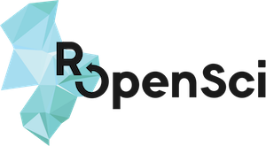

# rOpenSci Software Peer Review

<!-- README.md is generated from README.Rmd. Please edit that file -->

Thank you for considering submitting your package to the rOpenSci suite.
All the packages contributed by community members go through a process
of [open peer
review](https://ropensci.org/blog/2017/09/01/nf-softwarereview/) to
ensure a consistent level of quality for our users. This process also
allows us to ensure that your package meets our guidelines and provides
opportunity for discussion where exceptions are requested.

This README is a short intro to Software Peer Review for you as a
potential author or reviewer. For more information, consult our [gitbook
“rOpenSci Packages: Development, Maintenance, and Peer
Review”](https://devguide.ropensci.org/).

**Our [code of conduct](https://ropensci.org/code-of-conduct/) is
mandatory for everyone involved in our review process.**

  - [Why and how submit your package to rOpenSci?](#why-submit)
  - [Why and how review for rOpenSci?](#why-review)
  - [Further resources](#further)
  - [Editors and
reviewers](#editors)

# Why and how submit your package to rOpenSci?

  - First, and foremost, we hope you submit your package for review
    **because you value the feedback**. We aim to provide useful
    feedback to package authors and for our review process to be open,
    non-adversarial, and focused on improving software quality.
  - Once aboard, your package will continue to receive **support from
    rOpenSci members**. You’ll retain ownership and control of your
    package, but we can help with ongoing maintenance issues such as
    those associated with updates to R and dependencies and CRAN
    policies.
  - rOpenSci will **promote your package** through our [web
    page](https://ropensci.org/packages/),
    [blog](https://ropensci.org/blog/), and [social
    media](https://twitter.com/ropensci). Packages in our suite are also
    distributed via our [drat repository](http://packages.ropensci.org/)
    and [Docker images](https://hub.docker.com/r/rocker/ropensci/), and
    listed in our [task
    views](https://github.com/search?utf8=%E2%9C%93&q=user%3Aropensci+%22task+view%22&type=Repositories&ref=searchresults).
  - rOpenSci **packages can be cross-listed** with other repositories
    such as CRAN and BioConductor.
  - rOpenSci packages that contain a short accompanying paper can, after
    review, be automatically submitted to the [Journal of Open-Source
    Software](http://joss.theoj.org/) for fast-tracked publication.

If you want to submit a package, read our [guide for
authors](https://devguide.ropensci.org/guide-for-authors.html) before
opening a submission issue in this
repository.

## Why and how to review packages for rOpenSci?

  - As in any peer-review process, we hope you choose to review **to
    give back to the rOpenSci and scientific communities.** Our mission
    to expand access to scientific data and promote a culture of
    reproducible research is only possible through the volunteer efforts
    of community members like you.
  - Review is a two-way conversation. By reviewing packages, you’ll have
    the chance to **continue to learn development practices from authors
    and other reviewers**.
  - The open nature of our review process allows you to **network and
    meet colleagues and collaborators** through the review process. Our
    community is friendly and filled with supportive members expert in R
    development and many other areas of science and scientific
    computing.

To volunteer to be one of our reviewers, just click
[here](https://ropensci.org/onboarding/) to fill out a short form
providing your contact information and areas or expertise. We are always
looking for more reviewers with both general package-writing experience
and domain expertise in the fields packages are used for.

Please also read [our guide for
reviewers](https://devguide.ropensci.org/reviewerguide.html).

## Further resources

Our [gitbook “rOpenSci Packages: Development, Maintenance, and Peer
Review”](https://devguide.ropensci.org/) also includes:

  - [a guide for
    editors](https://devguide.ropensci.org/editorguide.html)

  - [our policies](https://devguide.ropensci.org/policies.html)

  - chapters dedicating to good practice for package maintenance

  - different templates: [review
    template](https://devguide.ropensci.org/reviewtemplate.html),
    [editor’s
    template](https://devguide.ropensci.org/editortemplate.html),
    [review request
    template](https://devguide.ropensci.org/reviewrequesttemplate.html).

Our review process is always in development, and we encourage feedback
and discussion on how to improve the process on our
[forum](https://discuss.ropensci.org/) and in the
[ropensci/software-review-meta issue
tracker](https://github.com/ropensci/software-review-meta/issues).

#  Editors and reviewers

### Associate editors

rOpenSci’s Software Peer Review process is run by:

  - [Noam Ross](https://github.com/noamross), EcoHealth Alliance
  - [Scott Chamberlain](https://github.com/sckott), rOpenSci
  - [Karthik Ram](https://github.com/karthik), rOpenSci
  - [Maëlle Salmon](https://github.com/maelle), rOpenSci
  - [Lincoln Mullen](https://github.com/lmullen), George Mason
    University
  - [Anna Krystalli](https://github.com/annakrystalli), University of
    Sheffield RSE
  - [Melina Vidoni](https://github.com/melvidoni), INGAR CONICET-UTN
  - [Brooke Anderson](https://github.com/geanders), Colorado State
    University

### Reviewers

We are grateful to the following individuals who have offered up their
time and expertise to review packages submitted to rOpenSci.

[Sam Albers](https://github.com/boshek) · [Toph
Allen](https://github.com/toph-allen) · [Alison
Appling](https://github.com/aappling-usgs) · [Zebulun
Arendsee](https://github.com/arendsee) · [Taylor
Arnold](https://github.com/statsmaths) · [Dean
Attali](https://github.com/daattali) · [Mara
Averick](https://github.com/batpigandme) · [Suzan
Baert](https://github.com/suzanbaert) · [James
Balamuta](https://github.com/coatless) · [David
Bapst](https://github.com/dwbapst) · [Joëlle
Barido-Sottani](https://github.com/bjoelle) · [Cale
Basaraba](https://github.com/calebasaraba) · [John
Baumgartner](https://github.com/johnbaums) · [Marcus
Beck](https://github.com/fawda123) · [Gabe
Becker](https://github.com/gmbecker) · [Jason
Becker](https://github.com/jsonbecker) · [Dom
Bennett](https://github.com/DomBennett) · [Kenneth
Benoit](https://github.com/kbenoit) · [Aaron
Berdanier](https://github.com/berdaniera) · [Fred
Boehm](https://github.com/fboehm) · [Carl
Boettiger](https://github.com/cboettig) · [Ben
Bond-Lamberty](https://github.com/bpbond) · [Alison
Boyer](https://github.com/alisonboyer) · [François
Briatte](https://github.com/briatte) · [Jenny
Bryan](https://github.com/jennybc) · [Lorenzo
Busetto](https://github.com/lbusett) · [Jorge
Cimentada](https://github.com/cimentadaj) · [Chase
Clark](https://github.com/chasemc) · [Jon
Clayden](https://github.com/jonclayden) · [Will
Cornwell](https://github.com/wcornwell) · [Enrico
Crema](https://github.com/ercrema) · [Ildiko
Czeller](https://github.com/czeildi) · [Laura
DeCicco](https://github.com/ldecicco-usgs) · [Christophe
Dervieux](https://github.com/cderv) · [Amanda
Dobbyn](https://github.com/aedobbyn) · [Jasmine
Dumas](https://github.com/jasdumas) · [Remko
Duursma](https://github.com/RemkoDuursma) · [Mark
Edmondson](https://github.com/MarkEdmondson1234) · [Paul
Egeler](https://github.com/pegeler) · [Evan
Eskew](https://github.com/eveskew) · [Manuel
Fernandez](https://github.com/manuramon) · [Kim
Fitter](https://github.com/kimnewzealand) · [Rich
FitzJohn](https://github.com/richfitz) · [Robert
Flight](https://github.com/rmflight) · [Zachary
Foster](https://github.com/zachary-foster) · [Auriel
Fournier](https://github.com/aurielfournier) · [Carl
Ganz](https://github.com/carlganz) · [Duncan
Garmonsway](https://github.com/nacnudus) · [Sharla
Gelfand](https://github.com/sharlagelfand) · [Monica
Gerber](https://github.com/monicagerber) · [Duncan
Gillespie](https://github.com/dosgillespie) · [David
Gohel](https://github.com/davidgohel) · [Laura
Graham](https://github.com/laurajanegraham) · [Charles
Gray](https://github.com/softloud) · [Corinna
Gries](https://github.com/cgries) · [Julia
Gustavsen](https://github.com/joolia) · [W Kyle
Hamilton](https://github.com/kylehamilton) · [Ivan
Hanigan](https://github.com/ivanhanigan) · [Jeff
Hanson](https://github.com/jeffreyhanson) · [Rayna
Harris](https://github.com/raynamharris) · [Ted
Hart](https://github.com/emhart) · [Nujcharee
Haswell](https://github.com/nujcharee) · [Verena
Haunschmid](https://github.com/expectopatronum) · [Andrew
Heiss](https://github.com/andrewheiss) · [Max
Held](https://github.com/maxheld83) · [Rafael Pilliard
Hellwig](https://github.com/rtaph) · [Bea
Hernandez](https://github.com/chucheria) · [Jim
Hester](https://github.com/jimhester) · [Peter
Hickey](https://github.com/PeteHaitch) · [Roel M.
Hogervorst](https://github.com/rmhogervorst) · [Jeff
Hollister](https://github.com/jhollist) · [Kelly
Hondula](https://github.com/khondula) · [Sean
Hughes](https://github.com/seaaan) · [Brandon
Hurr](https://github.com/bhive01) · [Najko
Jahn](https://github.com/njahn82) · [Tamora D
James](https://github.com/tdjames1) · [Max
Joseph](https://github.com/mbjoseph) · [Krunoslav
Juraic](https://github.com/kjuraic) · [Soumya
Kalra](https://github.com/sokal1456) · [Zhian N.
Kamvar](https://github.com/zkamvar) · [Michael
Kane](https://github.com/kaneplusplus) · [Andee
Kaplan](https://github.com/andeek) · [Hazel
Kavılı](https://github.com/UniversalTourist) · [Os
Keyes](https://github.com/Ironholds) · [Michael
Koontz](https://github.com/mikoontz) · [Bianca
Kramer](https://github.com/bmkramer) · [Anna
Krystalli](https://github.com/annakrystalli) · [Will
Landau](https://github.com/wlandau) · [Erin
LeDell](https://github.com/ledell) · [Thomas
Leeper](https://github.com/leeper) · [Mauro
Lepore](https://github.com/maurolepore) · [Stephanie
Locke](https://github.com/stephlocke) · [Robin
Lovelace](https://github.com/Robinlovelace) · [Julia Stewart
Lowndes](https://github.com/jules32) · [Tim
Lucas](https://github.com/timcdlucas) · [Andrew
MacDonald](https://github.com/aammd) · [Jesse
Maegan](https://github.com/kierisi) · [Tristan
Mahr](https://github.com/tjmahr) · [Ben
Marwick](https://github.com/benmarwick) · [Miles
McBain](https://github.com/milesmcbain) · [Lucy D’Agostino
McGowan](https://github.com/LucyMcGowan) · [Amelia
McNamara](https://github.com/ameliamn) · [Elaine
McVey](https://github.com/eamcvey) · [Bryce
Mecum](https://github.com/amoeba) · [Francois
Michonneau](https://github.com/fmichonneau) · [Jessica
Minnier](https://github.com/jminnier) · [Priscilla
Minotti](https://github.com/pmnatural) · [Nicole
Monhait](https://github.com/nmonhait) · [Paula
Moraga](https://github.com/Paula-Moraga) · [Ross
Mounce](https://github.com/rossmounce) · [Matt
Mulvahill](https://github.com/mmulvahill) · [Dillon
Niederhut](https://github.com/deniederhut) · [Rory
Nolan](https://github.com/rorynolan) · [Jakub
Nowosad](https://github.com/Nowosad) · [Daniel
Nüst](https://github.com/nuest) · [Paul
Oldham](https://github.com/poldham) · [Samantha
Oliver](https://github.com/limnoliver) · [Jeroen
Ooms](https://github.com/jeroen) · [Philipp
Ottolinger](https://github.com/ottlngr) · [Mark
Padgham](https://github.com/mpadge) · [Marina
Papadopoulou](https://github.com/marinapapa) · [Edzer
Pebesma](https://github.com/edzer) · [Thomas Lin
Pedersen](https://github.com/thomasp85) · [Nicholas
Potter](https://github.com/potterzot) · [Etienne
Racine](https://github.com/etiennebr) · [Nistara
Randhawa](https://github.com/nistara) · [David
Ranzolin](https://github.com/daranzolin) · [Neal
Richardson](https://github.com/nealrichardson) · [Emily
Riederer](https://github.com/emilyriederer) · [tyler
rinker](https://github.com/trinker) · [Emily
Robinson](https://github.com/robinsones) · [Julia
Romanowska](https://github.com/jromanowska) · [Xavier
Rotllan-Puig](https://github.com/xavi-rp) · [Bob
Rudis](https://github.com/hrbrmstr) · [Edgar
Ruiz](https://github.com/edgararuiz) · [Kent
Russel](https://github.com/timelyportfolio) · [Francisco Rodriguez
Sanchez](https://github.com/Pakillo) · [Alicia
Schep](https://github.com/AliciaSchep) · [Clemens
Schmid](https://github.com/nevrome) · [Marco
Sciaini](https://github.com/marcosci) · [Heidi
Seibold](https://github.com/HeidiSeibold) · [Julia
Silge](https://github.com/juliasilge) · [Margaret
Siple](https://github.com/mcsiple) · [Peter
Slaughter](https://github.com/gothub) · [Mike
Smith](https://github.com/grimbough) · [Frank
Soboczenski](https://github.com/h21k) · [Tuija
Sonkkila](https://github.com/tts) · [Gaurav
Sood](https://github.com/soodoku) · [Adam
Sparks](https://github.com/adamhsparks) · [Joseph
Stachelek](https://github.com/jsta) · [Christine
Stawitz](https://github.com/ChristineStawitz-NOAA) · [Irene
Steves](https://github.com/isteves) · [Michael
Sumner](https://github.com/mdsumner) · [Sarah
Supp](https://github.com/sarahsupp) · [Jason
Taylor](https://github.com/jmt2080ad) · [Filipe
Teixeira](https://github.com/FilipeamTeixeira) · [Andy
Teucher](https://github.com/ateucher) · [Jennifer
Thompson](https://github.com/jenniferthompson) · [Joe
Thorley](https://github.com/joethorley) · [Tiffany
Timbers](https://github.com/ttimbers) · [Tim
Trice](https://github.com/timtrice) · [Ted
Underwood](https://github.com/tedunderwood) · [Kevin
Ushey](https://github.com/kevinushey) · [Josef
Uyeda](https://github.com/uyedaj) · [Frans van
Dunné](https://github.com/FvD) · [Mauricio
Vargas](https://github.com/pachamaltese) · [Remi
Vergnon](https://github.com/remsamp) · [Claudia
Vitolo](https://github.com/cvitolo) · [Jake
Wagner](https://github.com/jacobpwagner) · [Ben
Ward](https://github.com/BenJWard) · [Elin
Waring](https://github.com/elinw) · [Rachel
Warnock](https://github.com/rachelwarnock) · [Leah
Wasser](https://github.com/lwasser) · [Lukas
Weber](https://github.com/lmweber) · [Karissa
Whiting](https://github.com/karissawhiting) · [Stefan
Widgren](https://github.com/stewid) · [Anna
Willoughby](https://github.com/arw36) · [Luke
Winslow](https://github.com/lawinslow) · [David
Winter](https://github.com/dwinter) · [Kara
Woo](https://github.com/karawoo) · [Bruna
Wundervald](https://github.com/brunaw) · [Lauren
Yamane](https://github.com/layamane) · [Taras
Zakharko](https://github.com/tzakharko) · [Hao
Zhu](https://github.com/haozhu233) · [Chava
Zibman](https://github.com/czibman) · [Naupaka
Zimmerman](https://github.com/naupaka) ·
[Lluís](https://github.com/llrs)
